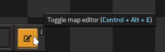
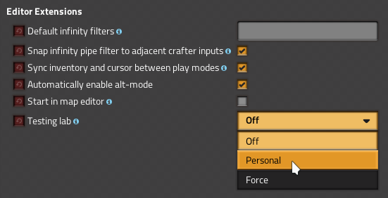
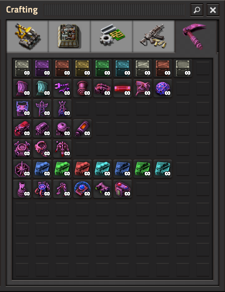
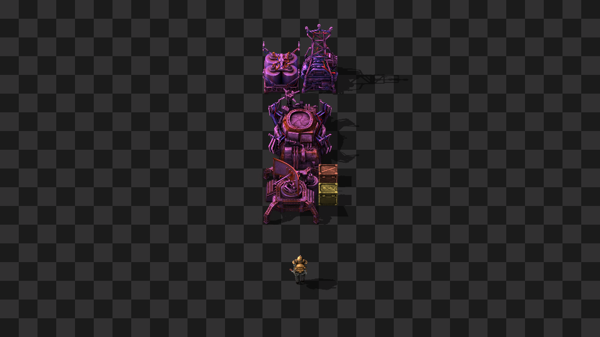

# Editor Extensions

Extends the Factorio map editor with new features, testing tools, and quality
of life changes. Also adds a separate editor lab that can be used to design
blueprints separately from your main factory.

## Installation

[Download on the Mod Portal.](https://mods.factorio.com/mod/EditorExtensions)

## Features

### Map editor conveniences

Enter the map editor by pressing the shortcut button, or by using `Control +
Alt + E`:

The mod will rearrange the top-left mod GUIs so that they remain visible while
inside the editor. If you have cheat mode enabled, your inventory and cursor
will be synced between the map editor and regular play.

### Personal or shared testing lab

Enable the testing lab in the per-player mod settings to teleport to an
isolated testing space when entering the map editor. This testing lab will run
alongside your actual factory, and you can freely design and test within the
lab without cheating in your actual game.

### Testing tools

The mod adds a variety of supercharged entities, items, and equipment for
testing your factories. Spawn or void items with the infinity chest, spawn or
void fluids with the infinity pipe, saturate or void your transport belts with
the infinity loader, and more.

The tools are only available when inside the map editor or when cheat mode is
enabled.

### Cheat mode

You can use the testing tools outside of the map editor by entering cheat mode
with the `/cheat` command. `/cheat all` will provide you with basic testing
items in your inventory, and give you a power armor kitted out with
supercharged equipment. You are essentially invincible, you run super fast, and
you have a personal roboport that can instantly construct or deconstruct.

### Testing scenario and debug world

The mod adds a new scenario specialized for testing. This scenario generates a
blank world filled with lab tiles, researches all technologies, enables cheat
mode, provides you with testing items and equipment, and sets up a super
roboport with super robots that can build or destroy anything you want. The
scenario also massively increases the speed at which construction orders are
dispatched.

aforementioned improvements, except for a pre-built roboport and radar.
game" buttons on the main menu) is optionally enhanced with all of the
The debug world (accessed by control + clicking the "single player" or "new
